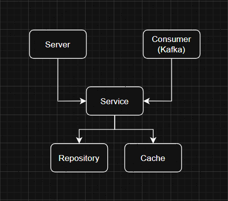

# L0 - Демонстрационный сервис заказов

Микросервис на Go для обработки заказов с использованием Kafka, PostgreSQL и Redis кеша.

## Описание проекта

Этот проект представляет собой демонстрационный микросервис, который:
- Получает данные о заказах из Kafka
- Сохраняет их в PostgreSQL
- Кеширует в Redis для быстрого доступа
- Предоставляет HTTP API для получения информации о заказах
- Включает веб-интерфейс для поиска заказов

## Демонстрация веб-интерфейса


## Архитектура



## Технологии

- **Backend**: Go 1.24.4
- **Web Framework**: Gin
- **Database**: PostgreSQL 15
- **Cache**: Redis 7
- **Message Broker**: Apache Kafka
- **Containerization**: Docker & Docker Compose
- **Database Migrations**: golang-migrate

## Структура проекта

```
L0/
├── cmd/
│   └── main.go                 # Точка входа приложения
├── internal/
│   ├── cache/                  # Кеш (Redis)
│   ├── config/                 # Конфигурация
│   ├── kafka/                  # Kafka consumer
│   ├── logger/                 # Логирование
│   ├── repository/             # Работа с БД
│   ├── server/                 # HTTP сервер
│   └── service/                # Бизнес-логика
├── migrations/                 # Миграции БД
│   ├── 001_create_orders_table.up.sql  
│   └── 001_create_orders_table.down.sql               
├── static/
│   └── index.html              # Веб-интерфейс
├── docker-compose.local.yml    # Docker Compose
├── Dockerfile                  # Docker образ
├── go.mod                      # Go модули
├── test_order.json             # Тестовые данные
└── send_test_order.go          # Скрипт отправки тестовых данных
```

## Быстрый старт

### Предварительные требования

- Docker и Docker Compose
- Go 1.24+ (для локальной разработки)

### Запуск с Docker Compose

1. Клонируйте репозиторий:
```bash
git clone https://github.com/AtoyanMikhail/wb.tech.L0.git
cd wb.tech.L0
```

2. Запустите все сервисы:
```bash
docker-compose -f docker-compose.local.yml up -d
```

3. Проверьте статус сервисов:
```bash
docker-compose -f docker-compose.local.yml ps
```

4. Откройте веб-интерфейс: http://localhost:8081

### Локальная разработка

1. Установите зависимости:
```bash
go mod download
```

2. Запустите инфраструктуру:
```bash
docker-compose -f docker-compose.local.yml up -d postgres redis kafka zookeeper
```

4. Запустите приложение:
```bash
go run cmd/main.go
```

## API Endpoints

### Получить заказ по ID

```
GET /order/{order_uid}
```

**Пример запроса:**
```bash
curl http://localhost:8081/order/myorder
```

**Пример ответа:**
```json
{
  "order_uid": "myorder",
  "track_number": "WBILMTESTTRACK",
  "entry": "WBIL",
  "delivery": {
    "name": "Test Testov",
    "phone": "+9720000000",
    "zip": "2639809",
    "city": "Kiryat Mozkin",
    "address": "Ploshad Mira 15",
    "region": "Kraiot",
    "email": "test@gmail.com"
  },
  "payment": {
    "transaction": "b563feb7b2b84b6test",
    "currency": "USD",
    "provider": "wbpay",
    "amount": 1817,
    "bank": "alpha",
    "delivery_cost": 1500,
    "goods_total": 317
  },
  "items": [
    {
      "chrt_id": 9934930,
      "name": "Myass",
      "price": 453,
      "total_price": 317,
      "brand": "nga",
      "sale": 30
    }
  ],
  "customer_id": "test",
  "delivery_service": "meest",
  "date_created": "2021-11-26T06:22:19Z"
}
```

## Тестирование

### Отправка тестового заказа

1. Запустите скрипт отправки тестового заказа:
```bash
./message_kafka.sh test_order.json localhost:9092 orders
```

2. Проверьте в веб-интерфейсе заказ с ID `myorder`

## Конфигурация

### Переменные окружения

Основные настройки находятся в файлах:
- `local.env` - для локальной разработки
- `docker.env` - для Docker окружения

**PostgreSQL:**
- `POSTGRES_DB` - имя базы данных
- `POSTGRES_USER` - пользователь БД
- `POSTGRES_PASSWORD` - пароль
- `POSTGRES_HOST` - хост БД
- `POSTGRES_PORT` - порт БД

**Kafka:**
- `KAFKA_BROKERS` - адреса брокеров
- `KAFKA_TOPIC` - топик для заказов
- `KAFKA_GROUP_ID` - ID группы потребителей

**Redis:**
- `REDIS_HOST` - хост Redis
- `REDIS_PORT` - порт Redis
- `REDIS_DB` - номер БД Redis
- `REDIS_PASSWORD` - пароль Redis
- `REDIS_PREFIX` - префикс ключей
- `REDIS_TTL` - время жизни кеша (секунды)


